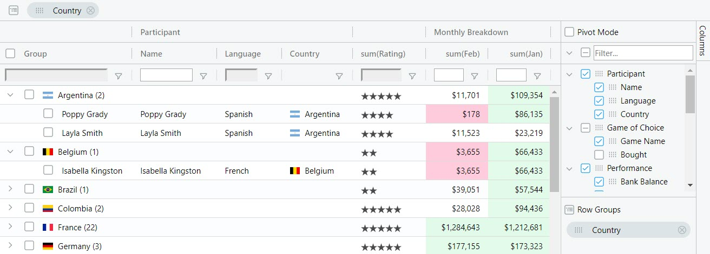

# React Data Grid Examples

React Data Grid Examples used on the ag-grid blog.

See the Posts:

- [Get Started with React Data Grid in 5 minutes](https://blog.ag-grid.com/react-get-started-with-react-grid-in-5-minutes/)
    - [code in integration-demo-classes](integration-demo-classes)
- [Create React Components for editing, filters and rendering of React data grid cells](https://blog.ag-grid.com/learn-to-customize-react-grid-in-less-than-10-minutes/)
    - [code in customization-demo-classes](customization-demo-classes)

## About AG Grid

ag-Grid is a fully-featured and highly customizable JavaScript data grid.
It delivers [outstanding performance](https://www.ag-grid.com/example.php), has no 3rd party dependencies and integrates with React as React Component. Here's how our grid looks like with multiple filters and grouping enabled:

Features
--------------

Besides the standard set of features you'd expect from any grid:

* Column Interactions (resize, reorder, and pin columns)
* Pagination
* Sorting
* Row Selection

Here are some of the features that make ag-Grid stand out:

* Grouping / Aggregation*
* Custom Filtering
* In-place Cell Editing
* Records Lazy Loading *
* Server-Side Records Operations *
* Live Stream Updates
* Hierarchical Data Support & Tree View *
* Customizable Appearance
* Customizable Cell Contents
* Excel-like Pivoting *
* State Persistence
* Keyboard navigation
* Data Export to CSV
* Data Export to Excel *
* Row Reordering
* Copy / Paste 
* Column Spanning
* Pinned Rows
* Full Width Rows

\* The features marked with an asterisk are available in the [enterprise version](https://www.ag-grid.com/license-pricing.php) only.

Check out [developers documentation](https://ag-grid.com/react-grid/) for a complete list of features or visit [our official docs](https://www.ag-grid.com/features-overview) for tutorials and feature demos.

License
------------------
This example project code is licensed under the MIT license. See the [LICENSE file](LICENSE) for more info.

Issue Reporting
----------
If you have found a bug, please report them at this repository `issues` section. If you're using Enterprise version please use the private ticketing system to do that [zendesk](https://ag-grid.zendesk.com/).

Asking Questions
-------------

Look for similar problems on [StackOverflow](https://stackoverflow.com/questions/tagged/ag-grid) using the `ag-grid` tag. If nothing seems related, post a new message there. Do not use GitHub issues to ask questions.
